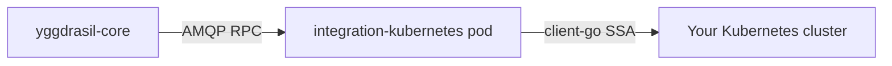

<div align="center">

# `integration-kubernetes`

**Yggdrasil adapter for Kubernetes** — deploy, apply, and observe K8s objects from declarative workflows

[](LICENSE)
[](https://github.com/dakasa-yggdrasil/integration-kubernetes/pkgs/container/integration-kubernetes)
[](https://github.com/dakasa-yggdrasil/yggdrasil-core)

</div>

---

## What it does

Yggdrasil integration adapter for Kubernetes. Registers under the `kubernetes`
family and exposes:

| Operation | Purpose |
|---|---|
| `declarative_apply` | Apply a desired object set via server-side apply (client-go dynamic client). |
| `apply_manifest` | Single-object variant used by `yggdrasil install` quickstarts. |
| `observe_objects` | Read live state of a desired object set. |

Workflows calling `use: { kind: integration, family: kubernetes, operation: <op> }`
resolve through this adapter at runtime.

## Install

```sh
yggdrasil install dakasa-yggdrasil/integration-kubernetes --provider kubernetes
```

The CLI walks the [`yggdrasil-quickstart.yaml`](yggdrasil-quickstart.yaml)
inputs (kubeconfig, namespace, image), then dispatches a workflow that
deploys the adapter + registers an `integration_instance` back in the core.

## Example workflow step

```yaml
- id: apply-namespace
  use:
    kind: integration
    family: kubernetes
    operation: apply_manifest
  with:
    manifest:
      apiVersion: v1
      kind: Namespace
      metadata:
        name: "{{ inputs.namespace }}"
```

## Credentials (one of)

- `kubeconfig` — inline YAML (stored as managed secret)
- `kubeconfig_path` — filesystem path inside adapter pod
- `in_cluster: true` — use the pod's own ServiceAccount

## Architecture



Stateless adapter. Every request carries the target instance credentials
from the core; the adapter assembles a REST config, runs the operation,
returns a structured result.

## Development

```sh
go test ./...
go build -o bin/integration-kubernetes .
docker build -t integration-kubernetes:dev .
```

## License

Apache 2.0 — see [LICENSE](LICENSE).

---

<div align="center">

Part of [Yggdrasil](https://github.com/dakasa-yggdrasil/yggdrasil-core) · [Catalog](https://github.com/dakasa-yggdrasil/yggdrasil-core/blob/main/docs/catalog.md)

</div>
